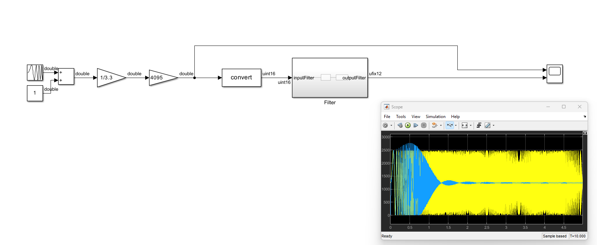
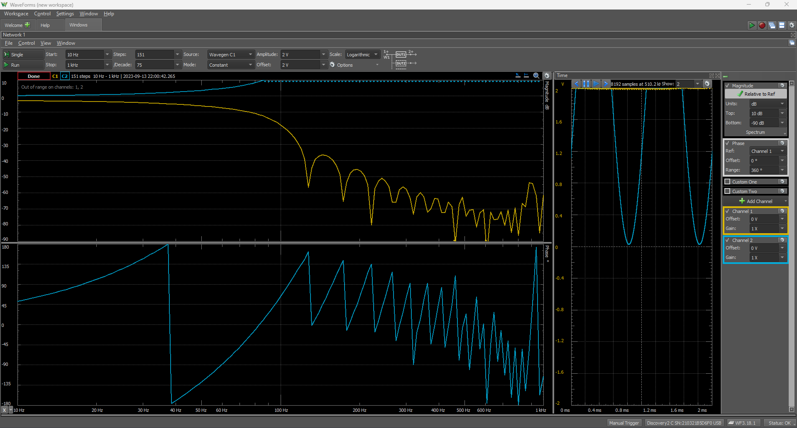

# This repository contains the implementation of a model generated Low-Pass FIR filter ran on an RP2040 microcontroller

## Model design

The filter was designed to operate at a sampling frequency of 1 KHz and to have a cut-off frequency of 100 Hz. The coefficients were generated using [FIIIR!](https://fiiir.com/), having a rectangular window type, and the general model was created in SIMULINK after which the Embedded Coder feature was used to generate ARM M compatible code.

The input of the model was designed to accept a uint16 data type, as the one returned by the ADC peripheral of the microcontroller.

The analog output of the microcontroller was simulated using a PWM output created with a timer peripheral. The timer was configured to have a TOP value of 12 bits. Because of this, the output of the filter returns a uint12 data type.

## Verification of the hardware implementation

After integrating the model generated code with the driver peripherals, I have used the network analyzer feature of the Analog Discovery 2 digital oscilloscope in order to find the frequency response of the filter. An RC filter was used to smooth out the output of the PWM. 

